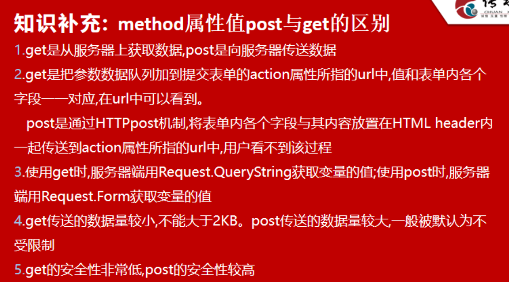

# HTML基础

> hyper text makeup language 超文本标记语言 (.html)
>
> XHTML 可扩展性超文本标记语言
>
> W3C：World Wide Web Consortium万维网联盟--国际中立性技术标准机构
>
> H4文档声明类型：严格类型strict，过渡

### HTML页面基本框架

~~~~html
<!DOCTYPE HTML><!--文档声明-->
<HTML>
    <!--HTML注释-->
    <head>
        <title>标题</title>
        <meta charset="utf-8">
    </head>
    <body>
        <header></header>
        <section></section>
        <footer></footer>
    </body>
    <foot></foot><!--已弃用-->
</HTML>
~~~~

### 不常用的HTML标签

~~~~html
<!--加粗-->
<b></b><strong></strong>
<!--小字-->
<small></small>
<!--倾斜-->
<i></i><em></em>
<!--删除线-->
<s></s><del></del>
<!--下划线-->
<u></u><ins></ins>
<!--上下标-->

<!--双引号-->
<q></q>
<!--标记黄底黑字-->
<mark></mark>
~~~~

### 常用的HTML标签

~~~~html
<!--标题标签-->
<h1></h1><h2></h2><h3></h3>
<!--段落标签-->

<!--强制换行-->
 
<!--软换行，宽度不够时主动换行-->
<wbr>
<!--水平线标签-->

<!--标签定义块，首尾缩进-->
<blockquote></blockquote>
<!--预格式化标签，完全保留原格式-->
<pre></pre>
<!--一般文本，不改变显示，只改变结构，行内标签-->

~~~~

### 特殊的标签

**图片**

~~~~html

<!--
src：图片的路径，一般用相对路径
title：图片悬停文本
alt：图像替代文字，在图片不显示时显示
height：图片的高
width：图片的宽
-->
~~~~

**超链接**

~~~~html
<a href="" name="" target="">链接文本或图像</a>
<!--
href：链接的跳转地址，#name指定锚点，#不跳转，url#name跳转至指定页面指定锚点
name：作为锚链接的跳转根据
target：链接的跳转位置  _blank(在新窗口打开) _self(默认本窗口打开)，_parent,_top,///////#锚链接name，框架name////id
功能性链接：
href="mailto:123456@qq.com":调用邮箱
href="tencent:1234567":调用QQ
-->
~~~~

### 特殊字符

| 空格     | &nbsp |
| -------- | ----- |
| 小于号   | &lt   |
| 大于号   | &gt   |
| 引号     | &quot |
| 版权符号 | &copy |

### 列表

**无序列表**

~~~~html
<ul type="disc">
	<li>新版鹿鼎记，张一山成最丑韦小宝？</li>
	<li>双十一在即，阿里内部全副武装</li>
</ul>
<!--
type：样式，disc(默认)实心圆，circle空心圆，square实心方块
块级元素，每个li标签独占一行
用于导航、侧边栏，新闻，有规律的图文组合模块
-->
~~~~

**有序列表**

~~~~html
<ol type="A" reversed start="3">
	<li>新版鹿鼎记，张一山成最丑韦小宝？</li>
	<li>双十一在即，阿里内部全副武装</li>
</ol>
<!--
type：样式，默认阿拉伯数字，“a”小写字母、“A”大写字母、“I”罗马数字
reversed：倒序排列
start：初始值
块级元素，有顺序
-->
~~~~

**定义列表**

~~~~html
<dl>
	<dt>计算机语言</dt>
	<dd>HTML</dd>
	<dd>JAVA</dd>
	<dd>C++</dd>
</dl>
<!--
<dl></dl>：声明定义列表
<dt></dt>：声明列表项，标题
<dd></dd>：定义列表项内容
块元素，默认无标记
-->
~~~~

### 表格

~~~~html
<table border="1px"  height="50px" width="300px" align="center" cellspacing="0" cellpadding="0">
	<caption>标题</caption>
	<tr>
		<th>第一行标题</th><td valign="top">111111</td><td>222222</td>
	</tr>
	<tr>
		<th>第二行标题</th><td>333333</td><td>444444</td>
	</tr>
</table>
<!--
table：声明表格
caption：表格的标题
tr：表格的行
th：单元格标题，加粗居中
td：单元格内容
-->
<!--
border：表格的边框
height：单元格高，用于table，td
width：单元格高，用于table，td
align：水平对齐方式，left（默认），right，center，设置table为整个表格对其，tr为行单元格内容对齐，td为单个单元格内容对齐
valign：垂直对齐方式，top，center，bottom，用于td
-->
<!--
cellspacing：外边距，单元格之间的间距，默认是2，无间距是0
cellpadding：内边距，单元格内容和格子的间距，默认是2，无间距是0
-->
<table border="1px">
	<tr>
		<th>第一行标题</th><td rowspan="2">111111</td><td>222222</td>
	</tr>
	<tr>
		<th>第二行标题</th><td>333333</td>
	</tr>
    <tr>
		<th>第三行标题</th><td colspan="2">111111</td>
	</tr>
	<tr>
		<th>第四行标题</th><td>333333</td><td>444444</td>
	</tr>
</table>
<!--
rowspan：行合并，用于td
colspan：列合并，用于td
-->

<colgroup>
<col span="1" style="background-color:#87ceea;">
<col span="4" style="background-color:#ffff00;">
<col span="1" style="background-color:#87ceea;">
<col span="3" style="background-color:#90ee90;">
</colgroup>
<!--
colgroup：设置列组，处理某个列，双标签
span：定义处理哪些列，单独处理时，须先处理前序列
col：单独列，span多列，单标签会覆盖colgroup
col和colgroup基本一样，可单独使用
-->
~~~~

### 结构及内联框架

~~~~html
<HTML>
    <head></head>
    <frameset cols="30%,30%,*" frameborder="20px" boder="10px" bordercolor="red">
	<frame src="../0617/课程表/课程表.html" name="frame1" framespacing="100px" noresize="noresize" marginheight="200px" marginwidth="100px">
	<frame src="../0617/课程表/课程表.html">
	<frame src="../0617/课程表/课程表.html">
</frameset>
</HTML>
<!--
cols：竖向分割（80%，20%），（50%，*，200px）
rows：横向分割（80%，20%），（50%，*，200px）
frameborder：是否显示框架边框1,0
border：框架边框宽度
bordercolor：框架边框颜色
frameset和frame必须一起使用
-->
<!--
src：页面地址
name：框架名
framespacing：框架与框架之间的距离
scrolling：是否显示滚动条yes,no,auto
noresize：框架尺寸不能随意改动 noresize="noresize"
marginheight：边框顶部和底部保留的空间
marginwidth：边框左右保留的空间
-->
<!--frameset不能和body标签嵌套-->
~~~~

**iframe**

~~~~html
<body>
    <iframe src="默认显示" name="框架名" align="" width="" height="" marginwidth="" marginheight="" >
</body>
<!--与frameset类似-->
~~~~

### 音视频元素

~~~~html
<video src="" controls></video>
<audio src="" controls>
    <source src="" type="">
</audio>
<!--
autoplay：自动播放autoplay
controls：显示控制按钮controls
src：路径
width：播放器宽度
height：播放器高度
loop：循环播放loop
muted：静音muted
preload：加载预备播放，none什么都不加载，metadata加载宽高，第一帧画面，auto要求浏览器尽快下载全视频
poster：视频下载显示图像，点击播放前显示图像，填写url路径
-->
~~~~

## 表单

~~~~html
<form method="get" action="day4.html" target="_blank">

用户名<input name="name" type="text" id="">

密&nbsp&nbsp&nbsp码<input name="pass" type="password">

   <input type="search" name="search" id="">
<input type="radio" name="sex" value="男" checked>男
<input type="radio" name="sex" value="女">女
<input type="checkbox" name="hobby" value="sports">运动
<input type="checkbox" name="hobby" value="talk">聊天
<input type="checkbox" name="hobby" value="play" disabled>玩游戏
<input type="email" name="">邮箱
<input type="url" name="">验证网址是否正确
<input type="number" name="" min="最小值" max="最大值" step="步长，合法的数字间隔">
<input type="range" name="" >
 <input type="color" value="默认显示颜色，使用编码">颜色选择器

</form>
<!--
表单属性：
name：表单名
method：get提交数据到url在url上明文显示，传送数据不得大于2kb，post
action：接收数据的页面
target：同a，常用_blank和_self
enctype：编码格式multipart/form-data（用于传送文件），application/x-www-form-urlencoded(默认，不能上传文件)，text/plain(未规范的编码，不使用)
autocomplete：on，off自动补全（H4不支持），可设置单个input实现单个控制
novalidate：novalidate，设置是否执行客户端数据有效性检查，使用则表单不验证表单的输入
-->

<!--
input属性
type：text（默认），password，checkbox(disabled不可选)，radio，submit，reset，file，hidden，image，button，number，search有×，range
name：input标签名
value：元素初始值，radio时必须指定一个值
size：表单元素的初始宽度，显示长度，text（默认20）及password以字符为单位，其他像素
checked：radio和checkbox时，指定选中
autofocus：使光标聚焦一input，直接输入
-->
<!--
id：全局属性，标签标识，有且唯一
-->
~~~~

### label标签

~~~~html
<label for="id">文本</label>
<!--一般与单选框复选框同用-->
<input type="checkbox" id="study" name="学习" value="study">
<label for="study">学习</label>
<input type="checkbox" id="reading" name="看书" value="reading">
<label for="reading">看书</label>
<input type="checkbox" id="sport" name="运动" value="sport">
<label for="sport">运动</label>
~~~~

### 下拉选择框

~~~~html
<select name="学历" size="3" multiple>
	<option value="primary">小学</option>
     <option value="junior">初中</option>
     <option value="high">高中</option>
     <option value="university">大学</option>
</select>
<!--
size：显示的选项个数，默认1
multiple：是否可以多选
-->
<select name="hobby" id="">
	<optgroup label="第一类">
        <option value="eat">吃饭</option>
        <option value="sleep">睡觉</option>
        <option value="play">打豆豆</option>
    </optgroup>
    <optgroup label="第二类">
        <option value=""></option>
        <option value=""></option>
        <option value=""></option>
    </optgroup>
</select>
~~~~

### 按钮

~~~~html
<input name="Button" value="提交" type="submit">
<input name="Reset" value="重填" type="reset">
<input name="Button" src="" type="image">
<input name="Reset" value="普通按钮" type="button">
<!--
submit：form关联的表单，可覆盖表单的属性
image：图片提交按钮
button：普通按钮
-->
~~~~

### 多行文本域

~~~~html
<textarea name="" rows="9" cols="3" style="resize:none;">内容</textarea>
<!--
rows：文本域高度
cols：文本域宽度
style="resize:none;：禁止改变大小
-->
~~~~

### 文件域

~~~~html
<input type="file" name="file">
<!--
enctype：编码格式multipart/form-data（用于传送文件）
-->
~~~~

### 日期控件

~~~~html
<input type="date">
<input type="month">
<input type="tel">
<input type="time">
<input type="week">
<input type="datetime-local：">
<input type="datetime">
<!--
date：年月日
month：年月
tel：移动端生效
time：时分秒
week：年周
datetime-local：年月日时分，系统时间
-->
~~~~

### 表单外的input，select等表单包含标签

> input的form属性填写form表单的id

### 表单元素的分组

~~~~html
<fieldset name="" id="" style="width:220px">
    <legend></legend>
</fieldset>
<!--
legend：分组标题
-->
~~~~

## 表单的高级应用

**隐藏域**

~~~~html
<input type="hidden" name="">
~~~~

**只读**

~~~~html
<input type="text" name="name" id="" readonly>
~~~~

> textarea

**禁用**

~~~~html
<input type="submit" name="pass" id=" " value="提交" disabled>
<!--按钮，下拉列表，复选框-->
~~~~

~~~~html
<!--
maxlength：限制文本长度，text，search，url，email，password
placeholder：文本框输入内容提示，text，search，url，email，password
required：必填项，text，search，url，
pattern：正则表达式，验证规则
list：建议值，用于text，联想autocomplete
-->
<input type="text " list="fl ">
    <datalist id="fl ">
      <option value="apple ">苹果</option>
      <option value="peach ">桃子</option>
      <option value="banana " label="香 ">香蕉</option>
      <option value="orange ">橘子</option>
    </datalist>
~~~~

